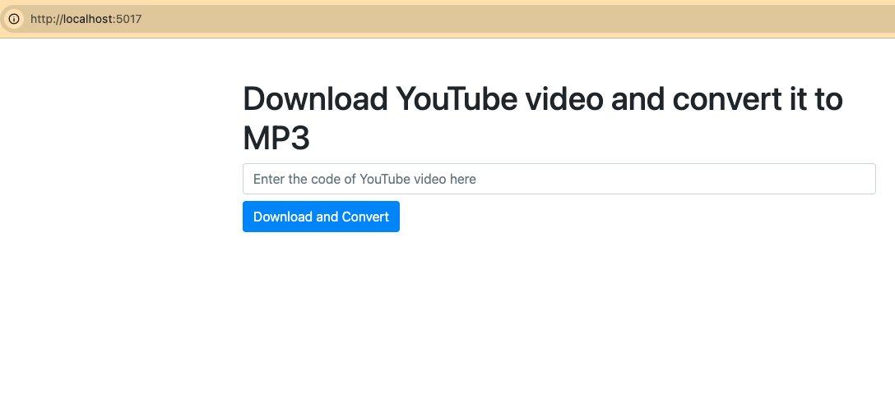
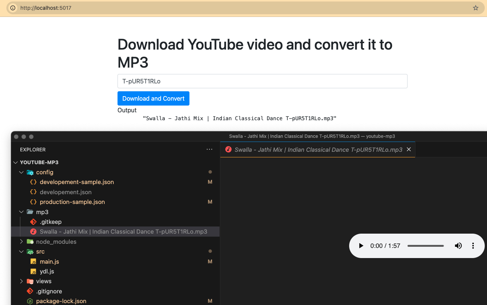

# Download youtube video and convert it to mp3

## Installation
1. Run `npm install` to install all dependencies;
2. Download [`ffmpeg`](https://www.ffmpeg.org/download.html);
3. Rename `config/production-sample.json` into `config/production.json` and fill it up;
4. Run `npm start` to start the server;
5. Open the app in the browser and put the code of an YouTube video in the field and press "Download and Convert" button. Video will be downloaded, converted in .mp3 and put in the `mp3` folder, specified in the config file.

## Screenshots

